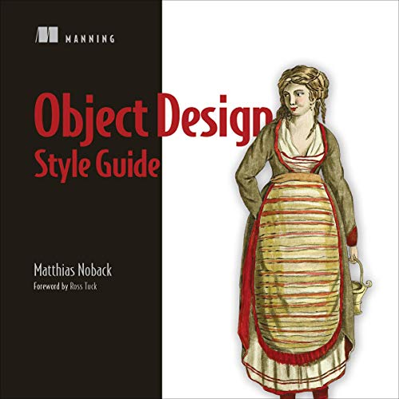

### Books

#### Object Design Style Guide

Great insights with practical demo's using a sudo code that works for most languages.
Each chapter has some exercises to test your skills.

-

- By: Matthias Noback
- Narrated by: Sarah Dawe
- Length: 5 hrs and 2 mins
- Unabridged Audiobook
- Release date: 18-03-2021
- Language: English
- Publisher: Manning Publications

[!badge size="l" variant="light" icon="../static/audible-icon.png" text="Object Design Style Guide"](https://www.audible.com.au/pd/Object-Design-Style-Guide-Audiobook/B08Z89FNDL?action_code=ASSGB149080119000H&share_location=pdp&shareTest=TestShare)
